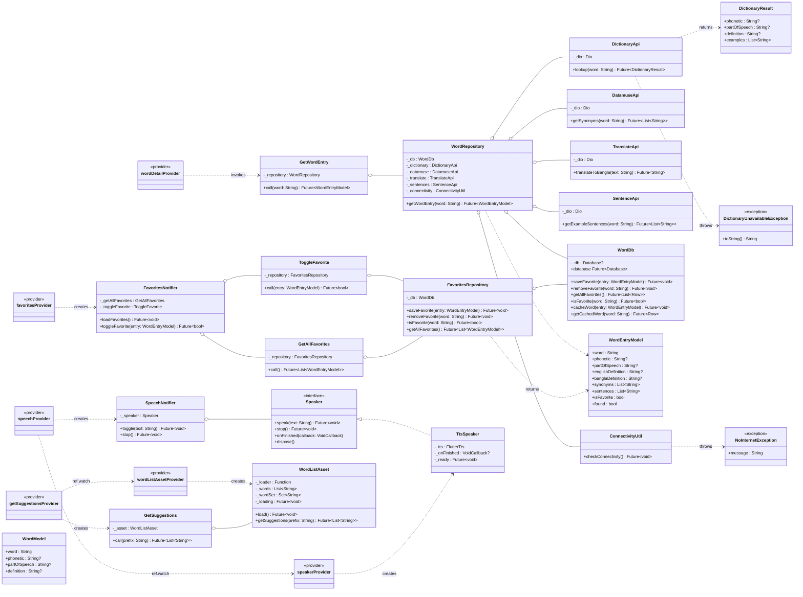
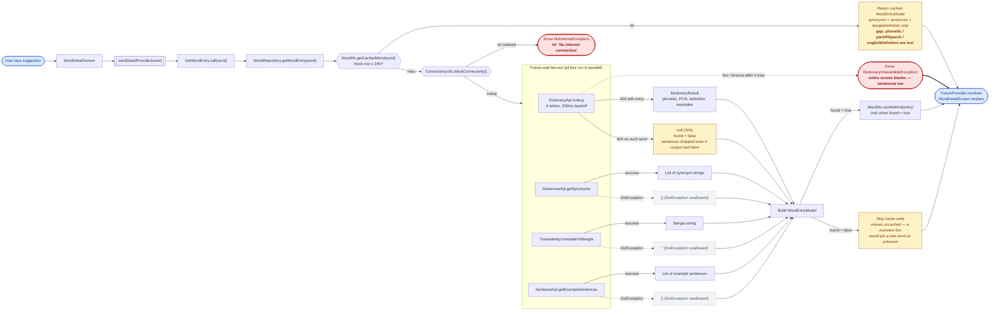

# Architecture

Word Depot is a Flutter app for looking up English words: type a word, get pronunciation, part of speech, English and Bangla definitions, synonyms, and example sentences, with favourites and text-to-speech. This document describes what the code is, not what it should be. Where the two disagree, both are stated.

The invariants and platform gotchas are in [`CLAUDE.md`](../CLAUDE.md). Read that alongside this file — it does not repeat what's here, and this does not repeat what's there.

Diagrams are embedded inline below (rendered by GitHub) and also live as editable Mermaid source under [`docs/diagrams/`](diagrams/). If you edit a diagram, update both.

---

## Layer overview and the dependency rule

Four top-level directories under `lib/`, each a layer:

- **`lib/domain/`** — usecases. One callable class per operation. No Flutter, no Dio, no sqflite imports.
- **`lib/data/`** — models, repositories, and datasources (local + remote). Talks to the outside world. Does not import from `domain/` or `presentation/`.
- **`lib/presentation/`** — Riverpod providers and screens. Depends on `domain/`, `data/` (via models), and `core/`.
- **`lib/core/`** — cross-cutting services (speech, connectivity), theme, router, constants. May be imported by any layer.

The intended dependency rule is unidirectional and inward:

```
presentation → domain → data
       └──────→ core ←──────┘
```

The reality: enforced by convention, not tooling. `flutter analyze` does not check import direction, and no lint rule prevents a screen from importing a repository. There is one existing violation — see [Known rough edges](#known-rough-edges).

**What may import what, in practice:**

| Layer      | May import from                             | Actually observed importing from            |
|------------|----------------------------------------------|---------------------------------------------|
| domain     | data (models + repositories), core          | data, core — clean                          |
| data       | core                                         | core — clean; no imports of domain / presentation |
| presentation | domain, data (models only), core          | **also imports `data/datasources/local/word_list_asset.dart` directly** |
| core       | (framework only)                             | flutter, third-party packages only          |

Class diagram — the whole graph, grouped by layer:



Source: [`docs/diagrams/class-diagram.mmd`](diagrams/class-diagram.mmd). `o--` edges are optional-ctor DI (a collaborator that is injected or default-constructed); `..>` edges are "creates" or "returns/throws".

There is no DI container. Every repository, usecase, and datasource takes its collaborators as optional named parameters and default-constructs them when nothing is passed. `WordRepository`'s constructor at [`word_repository.dart:19`](../lib/data/repositories/word_repository.dart) is the canonical example. Production passes nothing; tests pass fakes. The Riverpod provider graph is the composition root.

---

## External APIs

Four APIs, all keyless, all unauthenticated. Each is one class in [`lib/data/datasources/remote/`](../lib/data/datasources/remote/), each owns its own `Dio` with 10-second connect and receive timeouts, and each is default-constructed by `WordRepository` unless a test overrides it.

### DictionaryApi — [`dictionary_api.dart`](../lib/data/datasources/remote/dictionary_api.dart)

- **Purpose:** phonetic, part of speech, English definition, and curated example sentences.
- **Endpoint:** `GET https://api.dictionaryapi.dev/api/v2/entries/en/{word}`
- **Auth:** none.
- **Rate limits:** not visible in the client and not documented on the provider's site. The client retries `DioException`s up to 4 times with 300 ms × attempt backoff; there is no 429-specific handling. If the API starts rate-limiting, retries will just hasten the block.
- **Error contract:** returns `DictionaryResult?` — `null` for a 404 (word has no entry), throws `DictionaryUnavailableException` after all retries exhaust. This is the only API in the app that throws.

### DatamuseApi — [`datamuse_api.dart`](../lib/data/datasources/remote/datamuse_api.dart)

- **Purpose:** synonyms.
- **Endpoint:** `GET https://api.datamuse.com/words?rel_syn={word}&max={AppConstants.synonymLimit}`
- **Auth:** none.
- **Rate limits:** not visible in the client. Datamuse's site documents a free tier and points paid users at a different host; nothing in this code path handles either.
- **Error contract:** swallows `DioException`, returns `[]`.

### TranslateApi — [`translate_api.dart`](../lib/data/datasources/remote/translate_api.dart)

- **Purpose:** English → Bangla translation of the word itself.
- **Endpoint:** `GET https://api.mymemory.translated.net/get?q={text}&langpair=en|bn`
- **Auth:** none. MyMemory offers a keyed tier that raises the anonymous quota, but the client does not use it.
- **Rate limits:** not visible in the client.
- **Error contract:** swallows `DioException`, returns `""`.

### SentenceApi — [`sentence_api.dart`](../lib/data/datasources/remote/sentence_api.dart)

- **Purpose:** example sentences from the Tatoeba corpus.
- **Endpoint:** `GET https://tatoeba.org/en/api_v0/search?query==<word>&from=eng&sort=random&word_count_min=4&word_count_max=14`
- **Auth:** none.
- **Rate limits:** not visible in the client.
- **Licence:** Tatoeba sentences are CC BY 2.0 FR. The credit line at the bottom of the word detail screen ([`word_detail_screen.dart:471`](../lib/presentation/screens/word_detail/word_detail_screen.dart#L471)) is a licence requirement, not a courtesy.
- **Error contract:** swallows `DioException`, returns `[]`. Also filters the response client-side — capitalisation, terminating punctuation, exact word match with a leading word boundary, ≤100 characters. See `_readsAsSentence` and `_select` in the source.

All four run concurrently inside a single `Future.wait` in `WordRepository.getWordEntry`. The asymmetry — dictionary throws, the other three swallow — is the design; see [Error handling and offline behaviour](#error-handling-and-offline-behaviour).

---

## State management

Riverpod is the only state container. There are six providers total, all declared under [`lib/presentation/providers/`](../lib/presentation/providers/):

| Provider                  | Type                                                             | State held                                                     | Lives for                     |
|---------------------------|------------------------------------------------------------------|----------------------------------------------------------------|-------------------------------|
| `speakerProvider`         | `Provider<Speaker>`                                              | The `TtsSpeaker` singleton (a service, not app state)          | Life of `ProviderScope`       |
| `speechProvider`          | `StateNotifierProvider<SpeechNotifier, String?>`                 | Text currently being spoken, or `null`                         | Life of `ProviderScope`       |
| `wordListAssetProvider`   | `Provider<WordListAsset>`                                        | Parsed word list (frequency-ordered) once `load()` resolves    | Life of `ProviderScope`       |
| `getSuggestionsProvider`  | `Provider<GetSuggestions>`                                       | Callable — no state of its own                                 | Life of `ProviderScope`       |
| `wordDetailProvider`      | `FutureProvider.family<WordEntryModel, String>`                  | One `AsyncValue<WordEntryModel>` per word                      | Auto-disposed when unlistened |
| `favoritesProvider`       | `StateNotifierProvider<FavoritesNotifier, List<WordEntryModel>>` | In-memory mirror of the `favorites` sqflite table              | Life of `ProviderScope`       |

Provider-to-provider composition is by `ref.watch`. `speechProvider` watches `speakerProvider` to inject the `Speaker`. `getSuggestionsProvider` watches `wordListAssetProvider`. The rest default-construct their collaborators, which is where the optional-ctor DI pattern earns its keep.

**Where state actually lives**, ranked by durability:

1. **On disk** — sqflite (`favorites` and `word_cache` tables) and `SharedPreferences` (only `recent_searches`, a `List<String>` capped at 10).
2. **In `ProviderScope`, in memory** — `TtsSpeaker`, the parsed `WordListAsset`, the `FavoritesNotifier`'s list, the `SpeechNotifier`'s current-utterance string, and every cached `wordDetailProvider(word)` future result.
3. **In widgets** — `_HomeScreenState._recentSearches` (a local copy hydrated from `SharedPreferences`; the source of truth is still on disk), `_WordDetailScreenState._speech` (a held reference to `SpeechNotifier` so `dispose` can silence it after `ref` is invalidated — [`word_detail_screen.dart:26–41`](../lib/presentation/screens/word_detail/word_detail_screen.dart#L26)), and `_ExampleSentencesState._shown` (the current five-of-twelve drawn from the sentence pool; local so an unrelated rebuild doesn't reshuffle).

The `FavoritesNotifier`'s list is a full mirror of the `favorites` table. `toggleFavorite` writes to sqflite via the repository, then re-reads the whole list ([`favorites_provider.dart:18–22`](../lib/presentation/providers/favorites_provider.dart#L18)). This is not optimistic — the UI waits for the round trip — but the round trip is a sqflite call, so it's fine.

The bootstrap sequence below shows where each piece of state comes into being during cold start, and what happens on the first word lookup:

```mermaid
sequenceDiagram
    autonumber
    actor User
    participant main as main()
    participant WFB as WidgetsFlutterBinding
    participant WordDb
    participant Sqflite as sqflite Database
    participant PS as ProviderScope
    participant App as EnglishBuddyApp
    participant Router as appRouter (GoRouter)
    participant Home as HomeScreen
    participant Prefs as SharedPreferences
    participant Asset as WordListAsset
    participant Detail as WordDetailScreen
    participant WDP as wordDetailProvider
    participant WR as WordRepository
    participant Conn as ConnectivityUtil
    participant Dict as DictionaryApi
    participant DM as DatamuseApi
    participant TR as TranslateApi
    participant Sent as SentenceApi

    rect rgb(255, 244, 214)
    Note over main,Sqflite: STARTUP BUDGET — everything below is awaited before runApp

    User->>main: launch
    activate main

    main->>WFB: ensureInitialized()
    activate WFB
    WFB-->>main: bindings ready
    deactivate WFB

    main->>WordDb: WordDb().database  (await)
    activate WordDb
    WordDb->>Sqflite: getDatabasesPath()
    activate Sqflite
    Sqflite-->>WordDb: path
    deactivate Sqflite
    WordDb->>Sqflite: openDatabase(path, version: 1)
    activate Sqflite
    Note over Sqflite: onCreate runs on first install only —<br/>CREATE TABLE favorites<br/>CREATE TABLE word_cache<br/>(no migrations; version pinned at 1)
    Sqflite-->>WordDb: Database
    deactivate Sqflite
    WordDb-->>main: Database (cached in _db)
    deactivate WordDb

    main->>PS: runApp(ProviderScope(...))
    end

    activate PS
    PS->>App: build()
    activate App
    App->>Router: MaterialApp.router(routerConfig: appRouter)
    Router->>Home: builder for "/" -> HomeScreen()
    activate Home
    Home->>Home: initState()

    rect rgb(230, 244, 255)
    Note over Home,Asset: FIRE-AND-FORGET — not awaited; races the first frame and the first keystroke

    Home-)Prefs: _loadRecentSearches()  (async)
    activate Prefs
    Home-)Asset: ref.read(wordListAssetProvider).load()
    activate Asset
    Asset->>Asset: rootBundle.loadString('assets/data/words.json')
    end

    Home-->>User: FIRST FRAME (Scaffold + TypeAheadField + empty state)

    Prefs--)Home: recentSearches[]
    deactivate Prefs
    Home->>Home: setState(_recentSearches)

    Asset--)Asset: _words / _wordSet populated
    deactivate Asset

    deactivate Home
    deactivate App
    deactivate PS

    Note over User,Sent: User interaction — first word lookup after cold start

    User->>Home: types "apple"
    Home->>Asset: ref.read(getSuggestionsProvider)("apple")
    activate Asset
    Note over Asset: getSuggestions awaits load() —<br/>if the asset was still loading, this is where the caller pays
    Asset-->>Home: ["apple", "apples", ...]
    deactivate Asset
    Home-->>User: suggestions overlay

    User->>Home: tap suggestion "apple"
    Home->>Router: context.push('/word/apple')
    Router->>Detail: WordDetailScreen(word: "apple")
    activate Detail
    Detail->>WDP: ref.watch(wordDetailProvider("apple"))
    activate WDP
    Note over WDP,WR: GetWordEntry is a passthrough — it default-constructs<br/>WordRepository and calls getWordEntry(word)
    WDP->>WR: getWordEntry("apple")
    activate WR

    WR->>WordDb: getCachedWord("apple")
    activate WordDb
    WordDb->>Sqflite: SELECT * FROM word_cache WHERE word = ?
    activate Sqflite
    Sqflite-->>WordDb: row or empty
    deactivate Sqflite
    WordDb-->>WR: Map row  (null if empty or > 24h old)
    deactivate WordDb

    alt Cache hit (row present, cached_at within 24h)
        WR->>WordDb: isFavorite("apple")
        WordDb-->>WR: bool
        WR-->>WDP: WordEntryModel (from cache)
        Note over WR: phonetic / partOfSpeech / englishDefinition<br/>are NOT reconstructed — schema gap
    else Cache miss — go to network
        WR->>Conn: checkConnectivity()
        activate Conn

        alt Online
            Conn-->>WR: ok
            deactivate Conn

            par Future.wait fan-out (all four run concurrently)
                WR->>Dict: lookup("apple")
                activate Dict
                Note over Dict: 4 attempts, 300ms backoff.<br/>404 => null (no such word)
                Dict-->>WR: DictionaryResult
                deactivate Dict
            and
                WR->>DM: getSynonyms("apple")
                activate DM
                DM-->>WR: List of String  (empty on DioException)
                deactivate DM
            and
                WR->>TR: translateToBangla("apple")
                activate TR
                TR-->>WR: String  ('' on DioException)
                deactivate TR
            and
                WR->>Sent: getExampleSentences("apple")
                activate Sent
                Sent-->>WR: List of String  (empty on DioException)
                deactivate Sent
            end

            WR->>WR: build WordEntryModel(found: dictResult != null)

            opt found == true
                WR->>WordDb: cacheWord(entry)
                Note over WR,WordDb: misses stay OUT of cache —<br/>a 5xx would pin a real word as unknown for 24h
            end

            WR-->>WDP: WordEntryModel

        else No network — the only bootstrap-time error path
            Conn--xWR: throw NoInternetException
            deactivate Conn
            WR--xWDP: exception propagates
            Note over WDP,Detail: FutureProvider surfaces AsyncError.<br/>Detail screen renders "No internet connection".<br/>App itself is fully alive; only this lookup failed.

        else Dictionary unreachable after 4 retries
            Note over Dict: A throw inside Future.wait blanks the whole entry
            Dict--xWR: throw DictionaryUnavailableException
            WR--xWDP: exception propagates
            Note over WDP,Detail: Sentences etc. dropped even if the corpus responded —<br/>Detail screen shows the dictionary error.
        end
    end

    deactivate WR
    WDP-->>Detail: AsyncValue<WordEntryModel>
    deactivate WDP
    Detail-->>User: word entry rendered (phonetic, definitions, synonyms, sentences)
    deactivate Detail

    deactivate main
```

Source: [`docs/diagrams/bootstrap-sequence.mmd`](diagrams/bootstrap-sequence.mmd).

The startup budget — everything awaited before `runApp` — is small: `WidgetsFlutterBinding.ensureInitialized()` and `await WordDb().database`. The database open includes table creation on first install; subsequent launches are a cached `_db` and return immediately. `WordListAsset.load()` and `SharedPreferences.getInstance()` are fire-and-forget from `HomeScreen.initState`, so the first frame does not wait on them.

---

## Local persistence

Three places, in decreasing importance:

**sqflite — `english_buddy.db`, schema version 1.** Owned by `WordDb` at [`word_db.dart`](../lib/data/datasources/local/word_db.dart), which is a factory-based singleton so `WordDb()` returns the same instance from anywhere. The database is opened in `main` as a warm-up.

```sql
CREATE TABLE favorites (
  id             INTEGER PRIMARY KEY AUTOINCREMENT,
  word           TEXT UNIQUE NOT NULL,
  bangla_meaning TEXT,
  saved_at       INTEGER NOT NULL
);

CREATE TABLE word_cache (
  word           TEXT PRIMARY KEY,
  synonyms_json  TEXT,
  sentences_json TEXT,
  bangla_meaning TEXT,
  cached_at      INTEGER NOT NULL
);
```

`word_cache` entries expire after `AppConstants.cacheDurationHours` (24 h). Expiry is checked on read, and stale rows are deleted lazily inside `getCachedWord`. Nothing sweeps expired rows proactively.

**Migration strategy: there isn't one.** `openDatabase` is called with `version: 1` and only an `onCreate` handler. There is no `onUpgrade`, no `onDowngrade`, no migration test. Bumping the version without adding `onUpgrade` will throw on the next launch of an existing install. If you need to change the schema, you must:

1. Add the new columns / tables in `onCreate` for fresh installs.
2. Add an `onUpgrade` handler that runs the same DDL against existing databases.
3. Bump `version` from 1 to 2 in [`word_db.dart:23`](../lib/data/datasources/local/word_db.dart#L23).
4. Add a test that opens a v1 database and confirms the upgrade lands cleanly.

**SharedPreferences.** One key: `recent_searches`, a `List<String>` capped at `AppConstants.recentSearchLimit` (10). Written by `_HomeScreenState._saveRecentSearch` at [`home_screen.dart:44`](../lib/presentation/screens/home/home_screen.dart#L44). No versioning, no schema.

**Bundled asset — [`assets/data/words.json`](../assets/data/words.json).** A JSON array of English words, ordered by descending frequency. The order is load-bearing: `WordListAsset.getSuggestions` prefix-filters and takes the first N, so file order is the ranking. Regenerate with `dart run tool/generate_word_list.dart`; `test/data/word_list_asset_test.dart` asserts the ordering property.

---

## Error handling and offline behaviour

The app has no shared error channel. `WordRepository.getWordEntry` throws on hard failures; the `FutureProvider` surfaces those as `AsyncError`; the detail screen renders `e.toString()` with a retry button ([`word_detail_screen.dart:59–75`](../lib/presentation/screens/word_detail/word_detail_screen.dart#L59)). Nothing else has a user-visible error path — swipe failures, TTS errors, sqflite errors on the favourites path all bubble up as unhandled exceptions.

Two exception types are load-bearing:

- **`NoInternetException`** ([`connectivity.dart`](../lib/core/utils/connectivity.dart)) — thrown by `ConnectivityUtil.checkConnectivity()` when `connectivity_plus` reports no active connection. `WordRepository` calls this before every network fan-out, so being offline is reported as "No internet connection" rather than a dictionary failure.
- **`DictionaryUnavailableException`** ([`dictionary_api.dart:25`](../lib/data/datasources/remote/dictionary_api.dart#L25)) — thrown by `DictionaryApi.lookup` after four failed retries. This is the *only* datasource in the app that throws. The other three swallow `DioException` and return an empty value.

The asymmetry is intentional. `WordRepository` awaits all four APIs inside a single `Future.wait`; a throw from any of them rejects the whole call and blanks the detail screen. Dictionary is the only API whose absence makes the page unrenderable (no definition means no page), so it fails loudly. Synonyms / translation / sentences degrade gracefully — an empty synonym list just means fewer chips.

**Connectivity check caveats.** `connectivity_plus` only asks the OS whether an interface is up; it does not verify reachability. A phone on Wi-Fi with no route to the internet still passes `checkConnectivity()` and falls through to the dictionary retry loop, which will eventually throw `DictionaryUnavailableException`. That is a known limitation, not a bug.

**Cache behaviour on failure.** `word_cache` writes only when `dictResult != null` ([`word_repository.dart:85–87`](../lib/data/repositories/word_repository.dart#L85)). Misses are never cached, because `DictionaryApi.lookup` cannot always distinguish a genuine 404 from a transient 5xx — caching either would pin a real word as unknown for 24 hours. A cache hit does not require connectivity and does not check it. This means an offline user opening a previously-fetched word gets a partial render (see the schema gap under Known rough edges) rather than an error.

Data-flow diagram — the full read path with error branches:



Source: [`docs/diagrams/data-flow.mmd`](diagrams/data-flow.mmd).

---

## Known rough edges

Places where the code diverges from the ideal, stated plainly.

**1. `word_cache` schema drops three fields.** The `word_cache` table has no columns for `phonetic`, `part_of_speech`, or `english_definition`, and `WordRepository.getWordEntry`'s cache-hit branch does not reconstruct them ([`word_repository.dart:34–43`](../lib/data/repositories/word_repository.dart#L34), [`word_db.dart:33–41`](../lib/data/datasources/local/word_db.dart#L33)). Re-opening a word within its 24-hour cache window returns a `WordEntryModel` with `phonetic: null`, `partOfSpeech: null`, `englishDefinition: null`. The screen degrades silently — the pronunciation tag and English meaning disappear on a cache hit — which is why nobody noticed. Fixing it means adding the columns, updating the read path, and introducing the migration story described under [Local persistence](#local-persistence).

**2. Presentation imports a datasource.** [`search_provider.dart:7`](../lib/presentation/providers/search_provider.dart#L7) declares `wordListAssetProvider = Provider<WordListAsset>(...)`, and [`home_screen.dart:33`](../lib/presentation/screens/home/home_screen.dart#L33) reads it directly to trigger a boot-time `load()`. This is the one place a screen touches a datasource, and it violates the layer dependency rule stated above. A `WarmSuggestions` usecase (or moving the eager load into `GetSuggestions`) would fix it; nobody has bothered because the current shape is small enough to live with.

**3. No migration handler on the sqflite database.** `openDatabase` is called with `version: 1` and only `onCreate`. Any future schema change needs an `onUpgrade` handler added before the version can be bumped, or existing installs will crash. There is no test for the migration path.

**4. CI does not run the Flutter test suite.** [`.github/workflows/dart.yml`](../.github/workflows/dart.yml) is still the stock Dart template — it runs `dart analyze` and `dart test`, which do not exercise widgets, providers, or platform channels. The 92-test Flutter suite runs locally via `flutter test` and nowhere else. A green CI badge means nothing about the Flutter code.

**5. `Result<T>` is defined but unused.** [`lib/core/utils/result.dart`](../lib/core/utils/result.dart) declares a sealed `Result<T>` with `Success<T>` and `Failure<T>` variants. Nothing in `lib/` returns it — the error channel is exceptions throughout. Either wire it in as the return type on the repository or delete it.

**6. Usecases are mostly passthroughs.** Three of the four usecases (`GetWordEntry`, `GetSuggestions`, `GetAllFavorites`) forward directly to their repository with no added logic. Only `ToggleFavorite` reads current state and branches. The pattern earns its place because it keeps screens off repositories and makes the graph regular, but it is not carrying its weight in logic — a reader coming from a codebase where usecases orchestrate multiple repositories will be underwhelmed.
